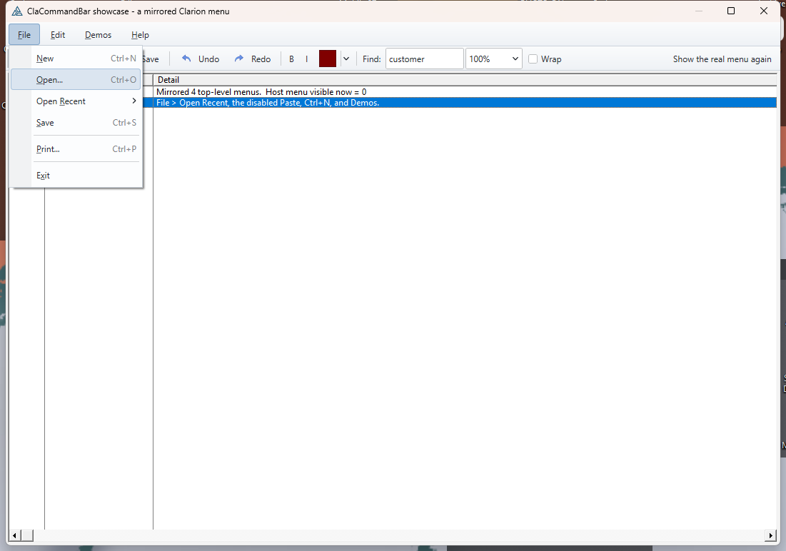
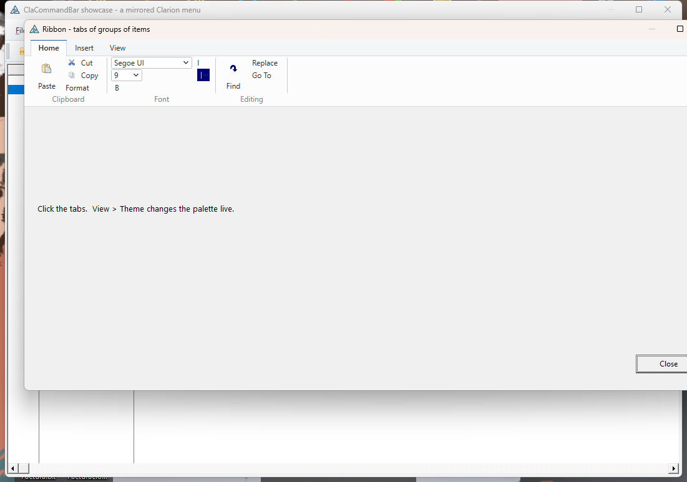
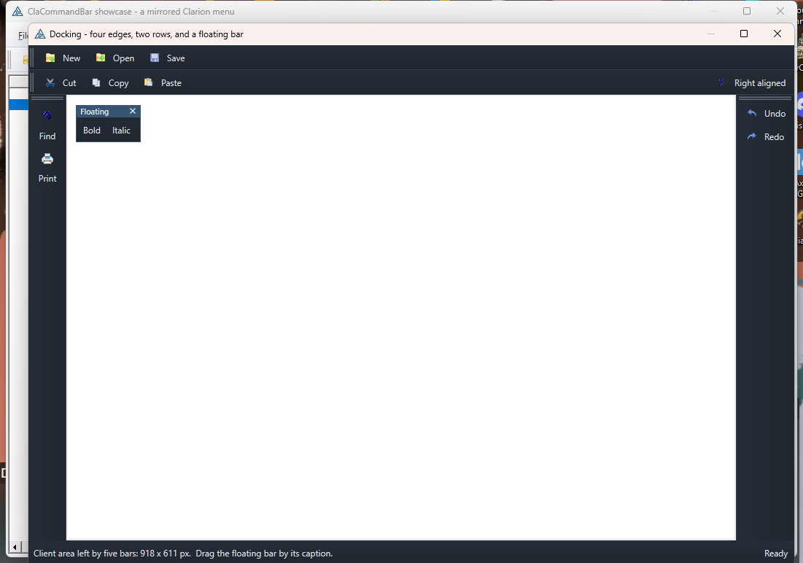
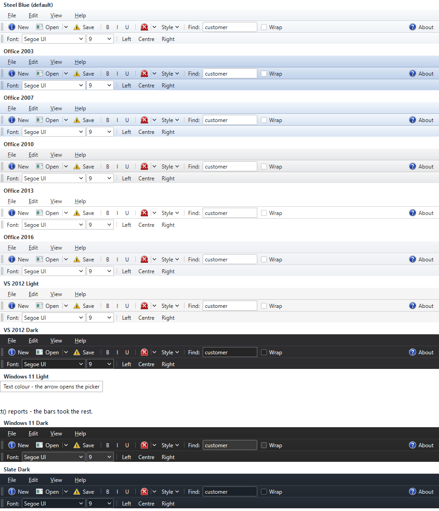
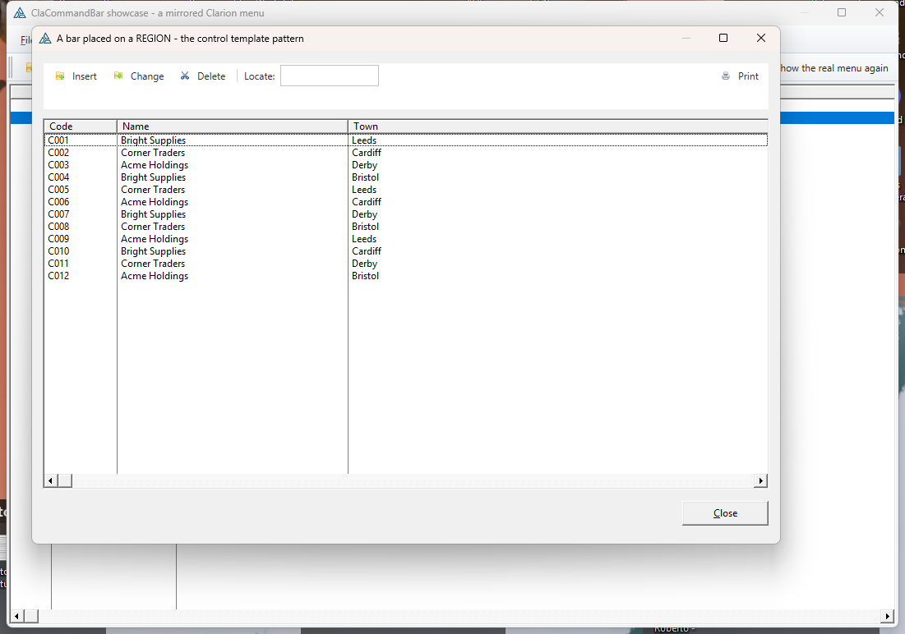

# ClaCommandBar — Direct2D command bars, ribbons and menus for Clarion

Codejock-style command bars, ribbons, menu bars and popup menus for Clarion
applications (9 through 12), rendered with Direct2D/DirectWrite by a native C++
DLL and wired into the Clarion AppGen through the `ClaCommandBar` template
chain (ABC).

Same shape as its sister project [ClaPropGrid](https://github.com/robertorenz/formToPropGrid):
a flat `__stdcall` C API in a 32-bit DLL, a Clarion wrapper class, ordinals
pinned as a contract, and templates that generate the wiring.

## It can take over the menu you already have



That menu is not hand-built. `MirrorMenu` reads the window's **own Clarion
`MENUBAR`** and rebuilds it as a command bar — the same order, the same
nesting, the separators, the `KEY()` attributes turned into a shortcut column,
and disabled items still disabled. Choosing a mirrored row POSTs
`EVENT:Accepted` to the **original `ITEM`**, so every menu embed you already
wrote goes on running and you re-declare nothing. Optionally the real menu is
taken off the frame entirely, so the command bar *replaces* it.

On an MDI frame the bar mirrors the **frame's own** `MENUBAR`. A menu that a
child window merges in cannot be mirrored — the child's controls live on the
child's thread and the merged Win32 menu is owner-drawn with no readable text —
so use `NOMERGE` on the children, or leave the real menu attached — but put it
on the **child**, never on the frame's own `TOOLBAR`, where it makes the
toolbar disappear as soon as any MDI procedure opens. The frame's toolbar and
MDI client are moved out from under the bars either way, including across the
toolbar Clarion rebuilds on every merge.

## One click gets you a starting point

Three buttons in the template fill the lists in. On the **Bars** tab, pick one
of five classics — *Standard*, *Formatting*, *Browse and records* (VCR keys,
Insert / Change / Delete, a locator), *Navigation* (a stretching address box)
or *Print and export* (an Export drop button carrying a menu of PDF, Excel,
CSV, HTML, XML and text). On the **Ribbon** tab, the ribbon from
`CommandBarShowcase`. On the **Menus** tab, one of File, Edit, Browse row,
View or Help. All of it comes with icons, tooltips and shortcuts, and what
they make is ordinary entries: rename, reorder or delete them, and fill in the
embed points.

Icons are named plainly (`NEW.ICO`). Add them to the application's project and
Clarion links them into the EXE, where they are found by resource name — no
loose files to deploy.

**It can take over the toolbar as well.** `MirrorToolbar` reads the frame's own
`TOOLBAR` and rebuilds every `BUTTON`, `CHECK`, `ENTRY`, `COMBO` and `PROMPT` in
it as bar items carrying their `ICON()`, `TIP()` and disabled state — choosing
one POSTs `EVENT:Accepted` to the original control. Hide the real toolbar and
Clarion's MDI toolbar merging, which hides it and rebuilds it every time a child
window opens, has nothing left on screen to disturb.

**It remembers where the user put things.** One INI entry holds which edge each
bar is on, which row, the order within it, whether it is showing, where a
floating one sits and whether a ribbon is collapsed — matched back by name, so
adding or removing a bar in a later release never hands an old position to the
wrong one.

## The documentation

Four volumes in `docs/`, each linking to the others:

| Volume | What it is |
|--------|------------|
| **1. Getting Started** | `getting-started.html` — install it, put a bar on screen by hand, then the same thing from AppGen in four steps |
| **2. Programmer's Guide** | `programmers-guide.html` — the concepts, the how-to, and why Clarion behaves as it does when it surprises you |
| **3. Template Guide** | `template-guide.html` — every template, tab, prompt, preset and embed point, and what the generator writes |
| **4. Reference** | `reference.html` — every property, method, export and equate, each with a worked line of Clarion |

The reference volume is **generated from the sources** — `commandbar.h`,
`commandbar.def` and `CommandBar.inc` — so a signature or an ordinal in it is
the one in the build. Rebuild all four after changing the API:

```
python docsuild-docs.py
```

It reports any class member that has no worked example, and any sidebar entry
whose wording has drifted from the heading it lands on, so neither the guide
nor its navigation can quietly fall behind the class.

## What you get

**Bars** dock top, bottom, left or right, stack in rows, sit side by side in a
row, float in a caption frame you can drag, or land exactly on a REGION you
positioned in the window designer. A bar can carry a gripper, large icons, no
border, or be the menu bar.

**Ribbons** — a bar of tabs, each tab a row of groups, each group full of
ordinary items. `CBIS:TextBelow` makes the big image-over-text button;
everything beside it stacks three-deep in small rows. A ribbon **collapses** to
its tab strip from the chevron at the end of the strip, from a double-click on a
tab, or from `MinimizeRibbon`.



**Items** — everything in one namespace, so a toolbar Save and a menu Save can
share a command id and be greyed out together with one call:

| | |
|---|---|
| `CBI:Button` | plain push button |
| `CBI:Toggle` | stays down until clicked again |
| `CBI:DropDown` | the whole button drops its menu |
| `CBI:Split` | left half is the command, right arrow opens the menu |
| `CBI:CheckBox` | box + text |
| `CBI:Color` | swatch button; the arrow opens the colour picker |
| `CBI:Edit` | in-bar type-in field |
| `CBI:Combo` | in-bar drop list |
| `CBI:Slider` | track and thumb, drag to set a value |
| `CBI:Spin` | number with up / down arrows |
| `CBI:Progress` | read-only, shows how far along |
| `CBI:Gallery` | a grid of picture choices — what a ribbon group wants |
| `CBI:Label`, `CBI:Separator`, `CBI:Space` | trim |
| `CBI:Menu` | a title on the menu bar |

Plus per item: image, tooltip, shortcut text, enabled / checked / visible,
right-align, wrap to a new row, image-above-text, icon-only, stretch-to-fill.

**Popup menus** chain submenus to any depth, with an icon gutter, check marks
and radio dots, a right-hand shortcut column, `&` accelerator underlines, full
keyboard navigation, and the slide-across behaviour that makes a menu bar feel
like a menu bar. `TrackMenu` pops one anywhere for a context menu.

**Docking on every edge at once**, plus a floating bar and a status strip —
and `ClientX/Y/Width/Height` reports exactly what is left for your own
controls. **Drag a bar by its gripper** to move it: a translucent hint shows
where it would land, an edge docks it there (re-laid out for that
orientation — a wide toolbar becomes a narrow column down the side), and the
middle tears it off into a floating frame. Drag a floating bar by its caption
to put it back. `Esc` cancels mid-drag:



**Overflow** — a bar too narrow for its items grows a chevron that drops the
rest, or wraps them onto extra rows.

**Eleven themes**, all professional, no purple:



Every one is stored as a *seed* — its surfaces, its text, its one accent — and
all 37 colour slots are **derived** from it. That is what makes `SetAccent` a
one-liner: change the accent and every hover, pressed, checked, gutter and
highlight shade is recomputed coherently, keeping the theme's light/dark
character. Any individual slot can still be overridden on top.

## Getting it

```
git clone https://github.com/robertorenz/ClarionCommandBar.git
```

`bin\commandbar.dll` and `clarion\commandbar.lib` are committed pre-built, so
you can install and use the templates without a C++ compiler — see
[`clarion\INSTALL.md`](clarion/INSTALL.md). Rebuild the engine only if you
change `src\`.

## The four templates

| Template | Kind | For |
|---|---|---|
| `CommandBarGlobal` | APPLICATION | add **once** per app: places the class and `commandbar.lib` |
| `CommandBarOnWindow` | PROCEDURE extension | bars, ribbons and menus on any window |
| `CommandBarControl` | CONTROL, MULTI | **dropped from the control palette** onto a window, browse or form. It places a REGION, and a bar ticked *Land on the region* fills it exactly instead of docking — so it takes nothing off the client area and the ABC resizer keeps moving it |
| `CommandBarFrame` | PROCEDURE extension | an application **FRAME**: everything above, plus mirroring or replacing the frame's own `MENUBAR` |



Define bars, ribbon tabs, groups, menus and items in a few lists; the template
generates the build, the event pump, the resize handling and **one embed point
per command id**. An item names the bar, ribbon group or menu it belongs to —
a name that resolves to nothing is a generate-time `#ERROR`, not a silently
missing button.

Every item also gets an **action**, the Clarion way:

| Action | What is generated |
|---|---|
| Call a procedure | `MyProcedure(parms)` |
| Do a routine | `DO MyRoutine` |
| Emulate a control | `POST(EVENT:Accepted, ?ThatButton)` — point a bar button at a BUTTON or menu ITEM already on the window |
| Post an event | `POST(EVENT:Whatever, ?Control)` |
| Close the window | `POST(EVENT:CloseWindow)` |

The action runs, then that command's embed point runs.

## Using it from code

```clarion
CB    CommandBarClass
bar   SIGNED
mFile SIGNED
it    SIGNED
  CODE
  OPEN(Window)
  CB.Init(Window, CBS:Tooltips + CBS:Chevron + CBS:MenuIcons)
  CB.SetTheme(CBT:Office2013)
  CB.SetAccent(COLOR:Teal)                       ! re-skin the whole palette

  !  take over the window's own MENUBAR, and drop the original
  CB.MirrorMenu(CB.AddMenuBar(), 1)

  bar = CB.AddBar('Standard', CBD:Top, CBBS:Gripper)
  CB.SetBarDock(bar, CBD:Top, 1, 0)              ! second row
  mFile = CB.CreateMenu()
  CB.AddButton(mFile, CMD:Save, '&Save', CB.AddImage('save.ico'))
  CB.AddSplitButton(bar, CMD:Open, 'Open', mFile, CB.AddImage('open.ico'))
  CB.AddCombo(bar, CMD:Zoom, '50%|100%|200%', 80)

  CB.AddClarionKey(CMD:Save, CtrlS)
  CB.Layout()
  CB.FitControl(?List, 4, 4)                     ! park the list under the bars

  ACCEPT
    CASE EVENT()
    OF EVENT:Timer
      LOOP WHILE CB.TakeOne()
        IF CB.LastEvent = CBE:Command AND CB.LastCmd = CMD:Save
          DO SaveIt
        END
      END
    OF EVENT:Sized
      CB.Layout()
      CB.FitControl(?List, 4, 4)
    OF EVENT:AlertKey
      IF CB.TakeAlertKey(KEYCODE()) THEN CYCLE.
    END
  END
  CB.Kill()
```

Or derive from `CommandBarClass` and override `TakeCommand`, `TakeToggled`,
`TakeSelChanged` and friends instead of reading `Last…`.

A ribbon is the same calls, one level deeper:

```clarion
rib = CB.AddRibbon('Ribbon', CBD:Top)
tab = CB.AddRibbonTab(rib, '&Home')
grp = CB.AddRibbonGroup(tab, 'Clipboard')
CB.AddLargeButton(grp, CMD:Paste, 'Paste', imgPaste)   ! the big one
CB.AddButton(grp, CMD:Cut,  'Cut',  imgCut)            ! stacks beside it
CB.AddButton(grp, CMD:Copy, 'Copy', imgCopy)
```

## Repository layout

| Path | Contents |
|------|----------|
| `src/` | `commandbar.h/.def` — the API and its pinned ordinals; `cb_internal.h`, `commandbar.cpp` (API + layout), `cb_render.cpp` (themes, drawing, window procedures, menu tracking); `testhost.c` — a standalone visual test; `build.bat`; `make-clarion-lib.ps1` |
| `bin/` | `commandbar.dll` (32-bit), `testhost.exe`, MSVC import lib |
| `clarion/` | `CommandBar.inc/.clw` — the wrapper class; `ClaCommandBar.tpl` — all four templates in one file; `commandbar.lib`; `INSTALL.md` |
| `docs/` | screenshots |
| `examples/` | `CommandBarShowcase/` — **start here**: a mirrored Clarion menu, a ribbon with a Styles **gallery** and a Zoom group holding a slider, a spin box and a progress bar, docking on four edges, and a bar on a REGION. `CommandBarDemo/` — one window exercising every item type and all eleven themes. `MenuMirrorTest/` — mirroring on a plain WINDOW and on an MDI APPLICATION frame that opens a merging child |

## Building the DLL

Run `src\build.bat` (needs Visual Studio 2022). It produces a **32-bit**
`bin\commandbar.dll` (Clarion apps are 32-bit), `testhost.exe` — a plain Win32
program that exercises every item type, the ribbon and every theme without
involving Clarion (`testhost.exe 7` starts on theme 7) — and
`clarion\commandbar.lib`, generated straight from `commandbar.def`.

**Export ordinals in `commandbar.def` are a contract. Never renumber or reuse
one**; new exports get the next free number, appended.

The DLL statically links the CRT, so the only runtime dependencies are stock
Windows DLLs — Windows 7 SP1 through Windows 11, no VC++ redistributable.

## How it was verified

Not by inspection:

* **the engine, standalone** — `testhost.exe` drives every item type, the
  ribbon, every theme, submenus, tooltips, the colour picker and the chevron;
* **the class, inside Clarion** — `examples\CommandBarShowcase` builds and
  runs, which is how the z-order, icon-scaling and menu-detach defects were
  found; clicking a mirrored menu row was checked to fire the original `ITEM`,
  submenu rows included;
* **the MDI frame path** — `examples\MenuMirrorTest\FrameMirrorTest` opens a
  real MDI child, on its own thread, carrying its own `MENUBAR` and `TOOLBAR`,
  which is how the space-reservation defects were found: the frame's children
  were enumerated before and after the merge, and the DLL traces every host
  child move to `%TEMP%\cbhost.log` when `CB_HOSTLOG=1` is set;
* **the templates, through AppGen** — registered with `ClarionCL -tr`, the
  frame extension attached to a shipped example app's FRAME and the window
  extension to one of its browses, populated through TXA, generated, and the
  generated code **compiled to a working EXE**. `INSTALL.md` §8 documents that
  loop so you can repeat it after any change.

## Status

Internal tool. Engine, wrapper, class and templates generated 2026-08-19.
