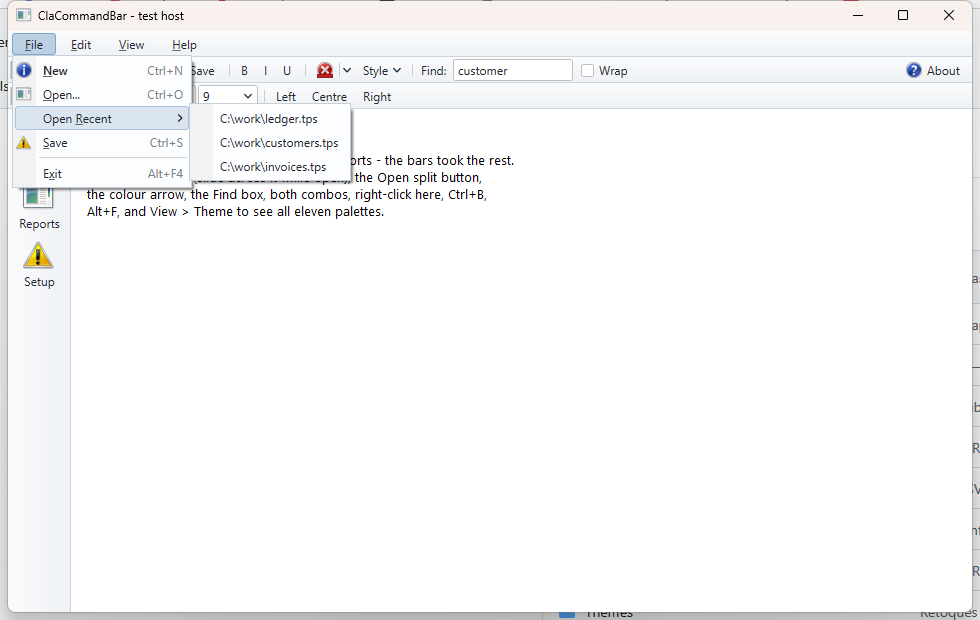

# ClaCommandBar — Direct2D command bars for Clarion

Codejock-style command bars, menu bars and popup menus for Clarion
applications (9 through 12), rendered with Direct2D/DirectWrite by a native C++
DLL and wired into the Clarion AppGen through the `ClaCommandBar` template
chain (ABC).

Same shape as its sister project [ClaPropGrid](https://github.com/robertorenz/formToPropGrid):
a flat `__stdcall` C API in a 32-bit DLL, a Clarion wrapper class, ordinals
pinned as a contract, and templates that generate the wiring.



*Above: a Clarion application. The menu bar, both toolbars, the left dock, the
split button, the combo, the colour picker and the in-bar edit are all drawn by
`COMMANDBAR.DLL`.*

## What you get

**Bars** dock top, bottom, left or right, stack in rows, sit side by side in a
row, or float in a caption frame you can drag (double-click the caption to send
it home). A bar can carry a gripper, large icons, no border, or be the menu bar.

**Items** — everything in one namespace, so a toolbar Save and a menu Save can
share a command id and be greyed out together with one call:

| | |
|---|---|
| `CBI:Button` | plain push button |
| `CBI:Toggle` | stays down until clicked again |
| `CBI:DropDown` | the whole button drops its menu |
| `CBI:Split` | left half is the command, right arrow opens the menu |
| `CBI:CheckBox` | box + text |
| `CBI:Color` | swatch button; the arrow opens the colour picker |
| `CBI:Edit` | in-bar type-in field |
| `CBI:Combo` | in-bar drop list |
| `CBI:Label`, `CBI:Separator`, `CBI:Space` | trim |
| `CBI:Menu` | a title on the menu bar |

Plus per item: image, tooltip, shortcut text, enabled / checked / visible,
right-align, wrap to a new row, image-above-text, icon-only, stretch-to-fill.

**Popup menus** chain submenus to any depth, with an icon gutter, check marks
and radio dots, a right-hand shortcut column, `&` accelerator underlines, full
keyboard navigation, and the slide-across behaviour that makes a menu bar feel
like a menu bar. `TrackMenu` pops one anywhere for a context menu.

**Overflow** — a bar too narrow for its items grows a chevron that drops the
rest, or wraps them onto extra rows.

**Eleven themes**, all professional, no purple:


Every one is stored as a *seed* — its surfaces, its text, its one accent — and
all 37 colour slots are **derived** from it. That is what makes `SetAccent` a
one-liner: change the accent and every hover, pressed, checked, gutter and
highlight shade is recomputed coherently, keeping the theme's light/dark
character. Any individual slot can still be overridden on top.

## Getting it

```
git clone https://github.com/robertorenz/ClarionCommandBar.git
```

`bin\commandbar.dll` and `clarion\commandbar.lib` are committed pre-built, so
you can install and use the templates without a C++ compiler — see
[`clarion\INSTALL.md`](clarion/INSTALL.md). Rebuild the engine only if you
change `src\`.

## Using it from the templates

Add `CommandBarGlobal` once at the application level, then
`CommandBarOnWindow` on any window. Define bars, menus and items in three
lists; the template generates the build, the event pump, the resize handling
and **one embed point per command id**.

An item names the bar or menu it belongs to. A name that resolves to nothing is
a generate-time `#ERROR`, not a silently missing button.

## Using it from code

```clarion
CB    CommandBarClass
bar   SIGNED
mFile SIGNED
it    SIGNED
  CODE
  OPEN(Window)
  CB.Init(Window, CBS:Tooltips + CBS:Chevron + CBS:MenuIcons)
  CB.SetTheme(CBT:Office2013)
  CB.SetAccent(COLOR:Teal)                       ! re-skin the whole palette

  mFile = CB.CreateMenu()
  CB.AddMenuTitle(CB.AddMenuBar(), '&File', mFile)
  it = CB.AddButton(mFile, CMD:Save, '&Save', CB.AddImage('save.ico'))
  CB.SetItemShortcut(it, 'Ctrl+S')

  bar = CB.AddBar('Standard', CBD:Top, CBBS:Gripper)
  CB.SetBarDock(bar, CBD:Top, 1, 0)              ! second row
  CB.AddSplitButton(bar, CMD:Open, 'Open', mFile, CB.AddImage('open.ico'))
  CB.AddCombo(bar, CMD:Zoom, '50%|100%|200%', 80)

  CB.AddClarionKey(CMD:Save, CtrlS)
  CB.Layout()
  CB.FitControl(?List, 4, 4)                     ! park the list under the bars

  ACCEPT
    CASE EVENT()
    OF EVENT:Timer
      LOOP WHILE CB.TakeOne()
        IF CB.LastEvent = CBE:Command AND CB.LastCmd = CMD:Save
          DO SaveIt
        END
      END
    OF EVENT:Sized
      CB.Layout()
      CB.FitControl(?List, 4, 4)
    OF EVENT:AlertKey
      IF CB.TakeAlertKey(KEYCODE()) THEN CYCLE.
    END
  END
  CB.Kill()
```

Or derive from `CommandBarClass` and override `TakeCommand`, `TakeToggled`,
`TakeSelChanged` and friends instead of reading `Last…`.

## Repository layout

| Path | Contents |
|------|----------|
| `src/` | `commandbar.h/.def` — the API and its pinned ordinals; `cb_internal.h`, `commandbar.cpp` (API + layout), `cb_render.cpp` (themes, drawing, window procedures, menu tracking); `testhost.c` — a standalone visual test; `build.bat`; `make-clarion-lib.ps1` |
| `bin/` | `commandbar.dll` (32-bit), `testhost.exe`, MSVC import lib |
| `clarion/` | `CommandBar.inc/.clw` — the wrapper class (compiles in any Clarion version); `ClaCommandBar.tpl` — the template chain; `commandbar.lib`; `INSTALL.md` |
| `docs/` | screenshots |
| `examples/` | `CommandBarDemo/` — a hand-coded Clarion app exercising every item type, all eleven themes, docking, floating and a context menu |

## Building the DLL

Run `src\build.bat` (needs Visual Studio 2022). It produces a **32-bit**
`bin\commandbar.dll` (Clarion apps are 32-bit), `testhost.exe` — a plain Win32
program that exercises every item type and every theme without involving
Clarion (`testhost.exe 7` starts on theme 7) — and `clarion\commandbar.lib`,
generated straight from `commandbar.def`.

**Export ordinals in `commandbar.def` are a contract. Never renumber or reuse
one**; new exports get the next free number, appended.

The DLL statically links the CRT, so the only runtime dependencies are stock
Windows DLLs — Windows 7 SP1 through Windows 11, no VC++ redistributable.

## How it was verified

Not by inspection:

* the engine, standalone — `testhost.exe` drives every item type, every theme,
  submenus, tooltips, the colour picker and the overflow chevron;
* the class, inside Clarion — `examples\CommandBarDemo` builds with MSBuild and
  runs, which is how the z-order and icon-scaling defects were found;
* the template, through AppGen — registered with `ClarionCL -tr`, attached to a
  procedure of a shipped example app via TXA, generated, and the generated code
  **compiled to a working EXE**. `INSTALL.md` §8 documents that loop so you can
  repeat it after any change.

## Status

Internal tool. Engine, wrapper and template generated 2026-08-19.
